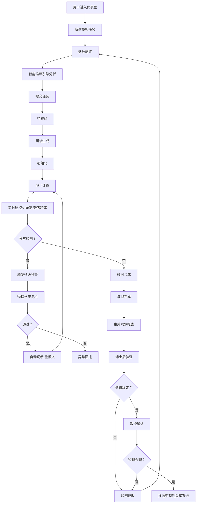

## 1. 产品概述

黑洞吸积盘广义相对论磁流体动力学(GRMHD)模拟与喷流反馈智能分析平台，为天体物理研究人员提供从参数配置、数值模拟、实时监控到智能分析的全流程科研工作台。平台内置自适应网格求解引擎、多级预警机制和智能推荐系统，支持高质量科学数据产出与审批流程管理。

## 2. 核心功能

### 2.1 用户角色

| 角色 | 说明 | 核心权限 |
|------|------|----------|
| 天体物理学家 | 研究人员，发起模拟 | 配置参数、发起模拟、查看结果、复核异常、提交审批 |
| 博士后 | 数值验证人员 | 验证数值稳定性、驳回/通过模拟结果 |
| 教授 | 物理合理性审核 | 确认物理合理性、推送至观测提案系统 |
| 首席科学家 | 平台管理员 | 管理参数系列、处理连续发散异常、查看全局统计 |

### 2.2 功能模块

1. **综合仪表盘**: 任务概览、实时统计、性能趋势、预警通知
2. **模拟任务管理**: 任务列表、状态追踪、参数系列管理、异常回退
3. **参数配置与提交**: 黑洞参数、磁场构型、初始条件、智能参数推荐
4. **实时监控中心**: MRI增长率曲线、喷流功率监控、吸积率预警、多级告警
5. **模拟结果可视化**: 磁场结构3D渲染、辐射光谱、能谱分布、光变曲线
6. **报告与数据导出**: PDF综合报告生成、全场数据导出、辐射数据导出
7. **审批工作流**: 博士后验证、教授确认、推送至观测提案系统
8. **智能推荐引擎**: 历史模拟分析、最优参数推荐、稳定喷流预测
9. **统计看板**: 完成率统计、平均耗时、喷流功率偏差、性能趋势

### 2.3 页面详情

| 页面名称 | 模块名称 | 功能描述 |
|----------|----------|----------|
| 综合仪表盘 | 任务概览卡片 | 展示待校验/运行中/已完成/异常任务数量，点击跳转对应列表 |
| 综合仪表盘 | 实时统计面板 | 今日完成率、平均计算耗时、活跃任务数、连续发散预警 |
| 综合仪表盘 | 性能趋势图 | 近30天模拟完成率趋势、平均耗时趋势、喷流功率偏差分布 |
| 综合仪表盘 | 预警通知流 | 吸积率突降预警、磁场异常预警、连续发散通知、审批待办提醒 |
| 模拟任务列表 | 任务卡片/表格 | 展示任务状态、黑洞参数、进度条、运行时长、当前阶段 |
| 模拟任务列表 | 状态流转追踪 | 可视化状态机：待校验→网格生成→初始化→演化计算→辐射合成→完成/异常回退 |
| 模拟任务列表 | 参数系列管理 | 按参数系列分组、连续发散自动暂停、系列状态控制 |
| 参数配置页 | 黑洞参数表单 | 质量(M☉)、自旋参数(a*)、倾角、吸积率初值 |
| 参数配置页 | 磁场构型 | 磁场强度(B)、拓扑结构(环形/极向/螺旋)、磁通量分布 |
| 参数配置页 | 初始条件 | 密度分布、温度剖面、角速度、扰动模式 |
| 参数配置页 | 智能推荐面板 | 基于历史模拟推荐最优参数组合、稳定喷流概率预测 |
| 实时监控页 | MRI增长率监控 | 实时折线图、理论基准线、增长率阈值告警 |
| 实时监控页 | 喷流功率监控 | 功率时变曲线、能量通量密度、准直度指标 |
| 实时监控页 | 吸积率监控 | 吸积率演化曲线、突降阈值检测、多级预警推送 |
| 实时监控页 | 异常复核面板 | 预警详情、物理学家复核意见、自动调参重新模拟 |
| 结果可视化页 | 磁场结构3D渲染 | 可交互三维磁场线渲染、密度等值面、喷流通道标注 |
| 结果可视化页 | 辐射光谱 | 多波段光谱图、同步辐射/逆康普顿分量分离 |
| 结果可视化页 | 能谱分布 | SED能谱分布、峰值频率、辐射效率标注 |
| 结果可视化页 | 光变曲线 | 多波段光变、闪烁指数、周期分析 |
| 审批工作流页 | 博士后验证面板 | 数值稳定性报告、收敛性检查、通过/驳回操作 |
| 审批工作流页 | 教授确认面板 | 物理合理性评估、与观测对比、通过/驳回操作 |
| 报告导出页 | PDF报告生成 | 磁场图、光谱、能谱、光变曲线综合报告、参数日志 |
| 报告导出页 | 数据导出 | 按自旋/磁通量/时间窗口筛选、导出等离子体参数和辐射数据 |
| 统计看板 | 全局统计 | 完成率热力图、参数空间分布、审批时效分析 |

## 3. 核心流程

用户登录后进入综合仪表盘，可查看全局任务状态和预警。点击"新建模拟"进入参数配置页，填写黑洞质量、自旋、磁场强度等参数，系统的智能推荐引擎基于历史数据给出最优参数建议。提交后任务进入"待校验"状态，系统自动构建自适应网格并启动GRMHD求解器。

模拟运行过程中，实时监控中心持续跟踪MRI增长率、喷流功率和吸积率，当检测到吸积率突降超阈值或磁场异常时自动触发多级预警并推送至天体物理学家。物理学家可在线复核，通过则系统自动调整初始扰动或磁场构型重新模拟并记录调整日志。

模拟完成后自动生成包含磁场三维渲染、辐射光谱、能谱分布和光变曲线的综合报告PDF，并支持按黑洞自旋、磁通量、时间窗口导出全场数据。模拟结果需经两级审批：博士后验证数值稳定性后提交教授确认物理合理性，通过后自动推送至观测提案生成系统。当同一参数系列连续三次发散时自动暂停该系列并通知首席科学家。每日自动统计完成率、平均耗时和喷流功率偏差，生成综合看板。

## 4. 用户界面设计

### 4.1 设计风格
- **主色调**: 深空靛蓝(#0a0e27)为背景，等离子体蓝(#00d4ff)为主强调色，吸积盘橙金(#ffaa00)为次强调色，警示红(#ff3b5c)
- **辅助色**: 磁场紫(#a855f7)、喷流青(#22d3ee)、引力绿(#10b981)
- **按钮风格**: 微玻璃拟态(glassmorphism)、圆角12px、发光悬停效果
- **字体**: 显示字体用Orbitron(科技感无衬线)，正文字体用JetBrains Mono(等宽数据字体)
- **布局风格**: 深色仪表盘布局、多层信息叠加、可拖拽数据面板、数据可视化为主
- **图标风格**: Lucide线性图标 + 自定义物理符号图标

### 4.2 页面设计概览

| 页面名称 | 模块名称 | UI元素 |
|----------|----------|--------|
| 综合仪表盘 | Hero区域 | 深空粒子动画背景、实时旋转吸积盘可视化、核心指标KPI卡片 |
| 综合仪表盘 | 状态网格 | 各状态任务统计卡片带微发光边框、点击态缩放动效 |
| 综合仪表盘 | 趋势图表 | 深色渐变面积图、多指标叠加、鼠标悬停数据点发光 |
| 参数配置页 | 参数表单 | 分段式表单、数值滑块带实时预览、参数联动校验 |
| 参数配置页 | 智能推荐 | AI推荐卡片、置信度环形进度条、历史相似案例预览 |
| 实时监控页 | 监控图表 | 实时流式折线图、阈值警戒线高亮、告警区域红色脉动 |
| 实时监控页 | 状态指示 | 状态徽章带呼吸灯效果、阶段进度条动画 |
| 结果可视化页 | 3D渲染区 | 可交互Three.js场景、轨道控制、磁场线发光效果 |
| 结果可视化页 | 多图联动 | 图表联动刷选、时间轴同步缩放、参数切片对比 |
| 审批工作流 | 审批卡片 | 审批人头像浮动、通过/驳回按钮带形变动效、审批时间线 |
| 统计看板 | 统计图表 | 热力图、桑基图、箱线图、参数空间散点图 |

### 4.3 响应式
- Desktop优先(1440px基准)，支持1920px大屏扩展
- 平板端(1024px)：侧边栏收起为图标导航，图表自适应缩放
- 移动端(768px)：底部Tab导航、单列表单、图表纵向堆叠
- 触控优化：大尺寸按钮、图表手势缩放、参数滑块触控优化

### 4.4 3D场景设计
- **环境/HDRI**: 深空星际背景、微弱星云环境光、动态星点粒子
- **光照**: 黑洞事件视界发光点光源(橙金)、吸积盘盘面辉光、喷流双向轴向光
- **相机**: 默认透视相机、轨道控制(OrbitControls)、限制极角避免翻转
- **构图**: 黑洞居左偏下、吸积盘斜切45°、喷流沿旋转轴延伸、信息面板居右
- **交互**: 鼠标悬停显示坐标/数值、点击区域放大、时间滑块动画播放/暂停
- **后处理**: Bloom发光效果、色调映射、FXAA抗锯齿、轻微暗角
- **资产**: 程序化生成，无外部依赖，性能目标60fps(中端GPU)
