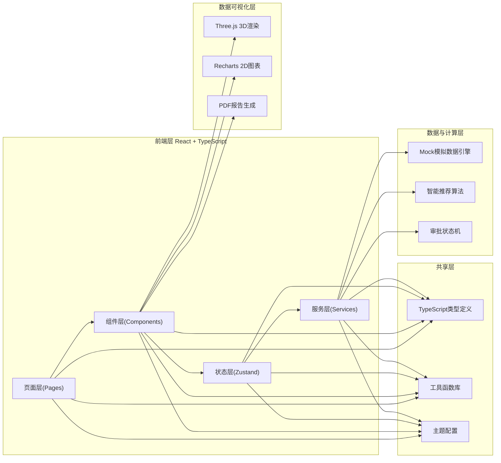
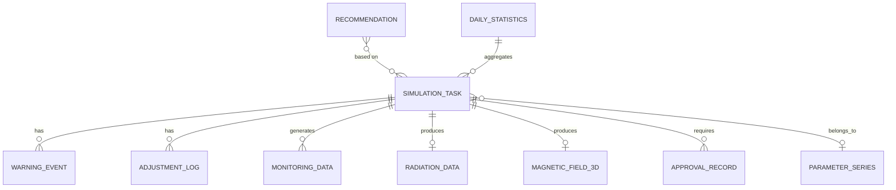

## 1. 架构设计



## 2. 技术栈说明

- **前端框架**: React@18 + TypeScript + Vite
- **状态管理**: Zustand (轻量级状态管理，支持多store)
- **路由**: React Router DOM@6
- **UI样式**: TailwindCSS@3 + CSS Variables主题系统
- **图标库**: Lucide React
- **3D可视化**: Three.js + @react-three/fiber + @react-three/drei + @react-three/postprocessing
- **2D图表**: Recharts
- **PDF生成**: jsPDF + html2canvas
- **后端**: Mock数据 + 前端模拟计算引擎(纯前端演示)
- **数据持久化**: LocalStorage存储任务状态和历史

## 3. 路由定义

| 路由路径 | 页面名称 | 说明 |
|----------|----------|------|
| `/` | 综合仪表盘 | 任务概览、实时统计、趋势图、预警通知 |
| `/simulations` | 模拟任务列表 | 所有任务、状态筛选、参数系列管理 |
| `/simulations/:id` | 模拟详情页 | 任务状态追踪、实时监控、结果可视化 |
| `/simulations/new` | 新建模拟任务 | 参数配置、智能推荐、提交任务 |
| `/monitoring` | 实时监控中心 | 全局MRI、喷流、吸积率监控面板 |
| `/approvals` | 审批工作流 | 待办审批、审批历史、推送状态 |
| `/exports` | 报告与数据导出 | PDF生成、数据筛选导出 |
| `/analytics` | 统计看板 | 全局统计、性能分析、参数空间分布 |
| `/recommendations` | 智能推荐引擎 | 推荐参数、历史分析、稳定喷流预测 |

## 4. 数据模型与类型定义

### 4.1 核心类型定义

```typescript
// 黑洞参数
interface BlackHoleParams {
  mass: number;           // 单位: M☉, 范围: 1-1e10
  spin: number;           // 单位: a*, 范围: 0-0.998
  inclination: number;    // 单位: 度, 范围: 0-90
  accretionRate: number;  // 单位: Ṁ/Ṁ_Edd, 范围: 0.001-100
}

// 磁场构型
interface MagneticFieldConfig {
  strength: number;       // 单位: 10^8 G, 范围: 0.01-100
  topology: 'toroidal' | 'poloidal' | 'helical';
  fluxDistribution: 'uniform' | 'gaussian' | 'power-law';
  fluxExponent: number;   // power-law指数
}

// 初始条件
interface InitialConditions {
  densityProfile: 'isothermal' | 'adiabatic' | 'power-law';
  temperature: number;    // 单位: 10^11 K
  angularVelocity: 'keplerian' | 'sub-keplerian' | 'super-keplerian';
  perturbation: number;   // 初始扰动幅度 0.001-0.1
}

// 模拟任务状态
type SimulationStatus = 'pending_validation' | 'mesh_generation' | 'initializing' | 'evolving' | 'radiation_synthesis' | 'completed' | 'error_fallback' | 'paused';

// 模拟任务
interface SimulationTask {
  id: string;
  name: string;
  params: BlackHoleParams;
  magneticField: MagneticFieldConfig;
  initialConditions: InitialConditions;
  status: SimulationStatus;
  progress: number;        // 0-100
  currentStep: number;
  totalSteps: number;
  startTime: number;
  endTime?: number;
  elapsedTime: number;     // 秒
  parameterSeriesId?: string;
  warnings: WarningEvent[];
  adjustmentLog: AdjustmentLog[];
  divergenceCount: number;
  approvalStatus: 'pending' | 'postdoc_approved' | 'professor_approved' | 'rejected';
}

// 预警事件
interface WarningEvent {
  id: string;
  simulationId: string;
  type: 'accretion_drop' | 'magnetic_anomaly' | 'divergence' | 'mri_anomaly';
  level: 'info' | 'warning' | 'critical';
  timestamp: number;
  description: string;
  threshold: number;
  actualValue: number;
  reviewed: boolean;
  reviewedBy?: string;
  reviewComment?: string;
}

// 调整日志
interface AdjustmentLog {
  id: string;
  simulationId: string;
  timestamp: number;
  adjustedParams: Partial<BlackHoleParams & MagneticFieldConfig & InitialConditions>;
  reason: string;
  reviewedBy: string;
}

// 实时监控数据
interface MonitoringData {
  simulationId: string;
  timestamp: number;
  timeStep: number;
  mriGrowthRate: number;
  jetPower: number;         // 单位: erg/s
  jetCollimation: number;   // 0-1
  accretionRate: number;
  magneticFieldStrength: number[]; // 各径向区域磁场
  temperature: number[];    // 各区域温度
  density: number[];        // 各区域密度
}

// 辐射数据
interface RadiationData {
  simulationId: string;
  spectrum: { frequency: number[]; flux: number[] };
  sed: { energy: number[]; luminosity: number[] };
  lightCurve: { time: number[]; flux: number[][]; bands: string[] };
}

// 3D磁场数据
interface MagneticField3D {
  fieldLines: { start: [number, number, number]; end: [number, number, number]; strength: number }[];
  densityField: Float32Array;
  gridDimensions: [number, number, number];
}

// 审批记录
interface ApprovalRecord {
  id: string;
  simulationId: string;
  type: 'postdoc_validation' | 'professor_confirmation';
  approver: string;
  decision: 'approved' | 'rejected';
  comment: string;
  numericalStability?: {
    convergenceRate: number;
    energyConservation: number;
    divergence: boolean;
  };
  physicalValidity?: {
    jetStability: number;
    mriSaturation: boolean;
    comparisonWithObservations: string;
  };
  timestamp: number;
}

// 参数系列
interface ParameterSeries {
  id: string;
  name: string;
  baseParams: BlackHoleParams;
  variableParams: (keyof BlackHoleParams | keyof MagneticFieldConfig)[];
  simulations: string[];
  status: 'active' | 'paused' | 'completed';
  consecutiveDivergences: number;
}

// 智能推荐
interface Recommendation {
  id: string;
  params: BlackHoleParams;
  magneticField: MagneticFieldConfig;
  initialConditions: InitialConditions;
  jetStabilityProbability: number;
  confidence: number;
  similarHistoricalSimulations: string[];
  expectedJetPower: number;
}

// 每日统计
interface DailyStatistics {
  date: string;
  totalSimulations: number;
  completedSimulations: number;
  completionRate: number;
  averageDuration: number;
  averageJetPowerDeviation: number;
  warningsCount: number;
  divergenceCount: number;
}
```

### 4.2 ER数据模型图



## 5. 前端Store结构

```
src/stores/
├── simulationStore.ts      # 模拟任务状态与操作
├── monitoringStore.ts      # 实时监控数据管理
├── approvalStore.ts        # 审批工作流状态
├── paramsStore.ts          # 参数配置与推荐
└── statisticsStore.ts      # 统计数据与仪表盘
```

## 6. 项目目录结构

```
src/
├── components/
│   ├── layout/            # 布局组件(Sidebar, Navbar, Layout)
│   ├── ui/                # 通用UI组件(Button, Card, Modal, Badge等)
│   ├── charts/            # 2D图表组件(LineChart, AreaChart等)
│   ├── three/             # 3D场景组件(BlackHoleScene, MagneticFieldLines等)
│   ├── simulation/        # 模拟相关组件(TaskCard, StatusTimeline等)
│   ├── monitoring/        # 监控组件(MRIPanel, JetPanel等)
│   ├── forms/             # 表单组件(ParamSlider, FieldSelector等)
│   └── approval/          # 审批组件(ApprovalCard, ApprovalTimeline等)
├── pages/
│   ├── Dashboard.tsx
│   ├── SimulationList.tsx
│   ├── SimulationDetail.tsx
│   ├── NewSimulation.tsx
│   ├── Monitoring.tsx
│   ├── Approvals.tsx
│   ├── Exports.tsx
│   ├── Analytics.tsx
│   └── Recommendations.tsx
├── stores/                # Zustand状态管理
├── hooks/                 # 自定义Hooks
├── utils/                 # 工具函数(模拟引擎、推荐算法、PDF生成等)
├── types/                 # TypeScript类型定义
├── data/                  # Mock数据与初始种子数据
├── assets/                # 静态资源
├── App.tsx
├── main.tsx
└── index.css
```
